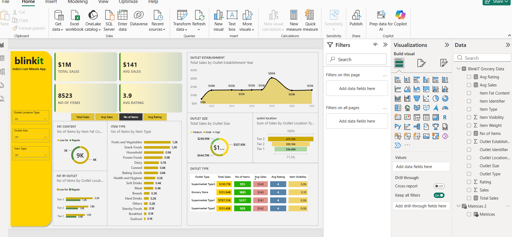

# blinkit-sales-dashboard
Blinkit sales analysis dashboard using Power BI

# 🛒 Blinkit Sales Analysis Dashboard

## 📌 Project Overview
An end-to-end data analytics project analyzing sales performance for Blinkit 
(India's Last Minute Delivery App) using Excel and Power BI. The dashboard 
provides insights into total sales, outlet performance, item categories, 
and location-wise trends to support data-driven business decisions.

## 🛠️ Tools & Technologies Used
- **Microsoft Excel** – Data collection & initial table structuring
- **Power Query** – Data cleaning and transformation
- **Power BI Desktop** – Data modeling, DAX calculations & dashboard design
- **DAX (Data Analysis Expressions)** – Custom measures for KPIs

## 🔄 Project Workflow
1. Collected raw sales dataset and structured it as a table in Excel
2. Imported data into Power BI using Get Data
3. Cleaned and transformed data using Power Query (handled nulls, 
   renamed columns, fixed data types)
4. Built data model and relationships between tables
5. Created DAX measures for key metrics (Total Sales, Avg Sales, 
   No of Items, Avg Rating)
6. Designed an interactive dashboard with slicers, KPI cards, 
   and visualizations

## 📊 Key Metrics on Dashboard
- Total Sales: $1M+
- Number of Items: 8,523
- Average Rating: 3.9
- Average Sales per Item: $141

## 💡 Key Insights
- **Supermarket Type1** generates the highest revenue ($787.55K) 
  among all outlet types
- **Tier 3** locations contribute the highest share of sales (472.13K), 
  followed by Tier 2 and Tier 1
- **Fruits & Vegetables** and **Snack Foods** are the top-selling 
  item categories (1.2K items each)
- Outlets established around **2018** show a significant spike in sales 
  ($205K), compared to other years
- **Medium-sized outlets** dominate total sales share among outlet sizes

## 📷 Dashboard Preview

## 📁 Files in this Repository
- `Blinkit_Sales_Dashboard.pbix` – Power BI project file
- `raw_data.xlsx` – Source dataset
- `dashboard_screenshot.png` – Dashboard preview image

## 🔗 Connect with Me
Feel free to reach out for feedback or collaboration opportunities!
